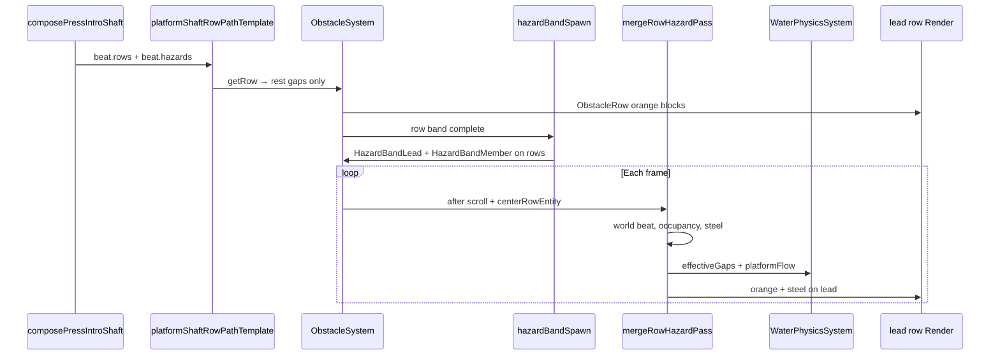

# Moving Hazard System — Architecture (L7)

**Status:** **Shipped** — row-integrated hazard bands on ObstacleRow (2026-07-04)  
**Parent:** [platform-shaft-roadmap.md](./platform-shaft-roadmap.md) §3 L7, [stage-hazard-progression-roadmap.md](./stage-hazard-progression-roadmap.md) §8 SH-011  
**Date:** 2026-07-04  
**Trigger:** Parallel `MovingHazard` entity stack caused steel float, width=0 pop-in, and pin rows below visible corridor — hazards now live on the row grid.

---

## 1. Problem statement

The game today assumes **one entity type per row**: `ObstacleRow` with static `gaps[]`, orange block render layers, and collision derived from those gaps. Water, swimmer physics, and gap-range shaders all sample **row gap columns**.

**Platform press shafts** (and future iris, vise, buzz wheel, tilt gate) need **time-varying column occupancy** — steel slides in, gap narrows 3→2→1, water push changes. That is not a render tweak; it is a **second entity class** with its own motion FSM, collider, and water coupling.

What the player saw (blue/gray squares + orange blocks beside them) was a **Slice 3 stub**:
- `effectiveGapsAtFullPress` baked press geometry into static row gaps (fake “extended” orange blocks)
- Steel drawn as special-case layers on gap columns
- Zero integration with collision, water flow, or per-frame motion

**That stub is removed.** Slice 3 now ships **path-only**: corridor rows from `composePressIntroShaft` at **rest geometry**. Hazards live in `beat.hazards` until Slice 5 spawns `MovingHazard` entities.

---

## 2. Locked split (SH-011)

| Entity | Art | Motion | Collision | Examples |
|--------|-----|--------|-----------|----------|
| **ObstacleRow** | Orange clay `swimmerBlocks` | None (scrolls with water) | Static `gaps[]` | Cave pin, ceiling, corridor walls |
| **MovingHazard** | Steel / metal WebP sheets | Timed press, rotate, sweep | Dynamic column mask per frame | Platform slab, iris clamp, buzz wheel |

> Orange blocks = static pin danger. Metal = stage gimmick. Never animate orange sprites for machinery motion.

---

## 3. What Slice 3 leaves (valid foundation)

These pieces are **standard** and stay:

| Module | Role |
|--------|------|
| `platformShaft/primitives.ts` | Grid helpers, `corridorRowForSlab`, `effectiveGapsAtFullPress` (runtime, not spawn) |
| `platformShaft/harmonizer.ts` | pressCols cap, fairness |
| `platformShaft/composePressIntroShaft.ts` | L3 recipe → `RecipeOutput` |
| `platformShaft/platformShaftRowPathTemplate.ts` | Streams **rest** corridor rows; `beat.hazards` in template ctx |
| `ObstacleSystem` shaft lock props | `storyLockedShaftRecipe` → `platformShaftIntro` template |
| `buildObstacleRowRenderLayers.ts` | Orange blocks only — unchanged |

**Visual test for Slice 3 (corrected):** intro shaft **corridor layout** — runway, chicane drift, 2-col chute rows, release. **No steel, no 1-col squeeze yet.** That requires Slice 5.

---

## 4. Row-integrated hazard bands (shipped)

Hazards are **optional ECS components on existing ObstacleRow entities**, not separate entities.

### 4.1 Components

| Component | Row | Fields (conceptual) |
|-----------|-----|---------------------|
| **HazardBandLead** | `bounds.rowStart` (water-closest / anchor) | `bounds`, `params`, `memberRowEntityIds`, `maxWorldBeat`, `phase01`, `localSec` |
| **HazardBandMember** | Other band rows | `modifierId`, `leadEntityId` |

`ObstacleRow.gaps` = rest corridor (orange only, never mutated).  
`ObstacleRow.effectiveGaps` = written by `mergeRowHazardPass` on member rows only.

### 4.2 Spawn — `hazardBandSpawn.ts`

When `platformShaftIntro` streams row `rowIndex`:
1. Read `beat.hazards` from template ctx
2. When full row band exists (`resolveRowEntitiesForBeatRange` + epoch filter) → attach lead on anchor row, members on rest
3. **Do not** mutate row `gaps[]` at spawn

### 4.3 Motion — `mergeRowHazardPass` (ObstacleSystem tail)

Per frame (worklet):
1. `worldBeatFromWaterLock` from `Water.centerRowEntity` → `latchedWorldBeat` per lead
2. `hazardLocalSecFromBeatRow` → `simPlatformPress` → `resolvePlatformSlabOccupancy` per member row
3. Write `effectiveGaps` / `effectiveSolidColumnCentersX` on members
4. Append steel layers on **lead** `RenderComponent` (`appendHazardSteelToRowRender`) — telegraph at phase 0
5. `flowFromPlatform` → `Water.platformFlowPerRange` (max across leads)

### 4.4 Collision

`WaterPhysicsSystem` and `swimmerBlockCollision` read `effectiveGaps ?? gaps` — unchanged contract.

### 4.5 Water

`flowFromPlatform.ts` — PS-007 flow when press advances and gap tightens.

### 4.6 Render

- Orange: `buildObstacleRowRenderLayers` on each row (unchanged)
- Steel: single multi-row rect on lead row; `position.y` = mean member Y; orange layers offset to stay world-aligned

---

## 4-archive. MovingHazard entity stack (removed 2026-07-04)

The original L7 design used a separate `MovingHazard` entity + `HazardMotionSystem`. Replaced by row bands above. Sections below retained for historical context.

### 4.1-archive Component — `MovingHazardComponent`

```typescript
type MovingHazardKind = 'platform_slab' | 'iris_clamp' | 'buzz_wheel' | 'tilt_gate' | 'vise_jaw';

type MovingHazardComponentData = {
  kind: MovingHazardKind;
  hazardId: string;           // matches beat hazard id
  side: 'left' | 'right';
  /** Row band this hazard spans (template row indices). */
  rowStart: number;
  rowEnd: number;
  /** Anchor column at rest (press wall col). */
  anchorCol: number;
  /** Composed params from harmonizer (pressCols, duration, ease, telegraph). */
  params: PlatformSlabParams; // generalize later per kind
  /** 0..1 press progress; 0 = rest, 1 = full press (hold). */
  phase01: number;
  /** World Y of hazard center (follows row band as rows scroll). */
  y: number;
  /** Linked obstacle rows for row-band tracking (optional). */
  rowEntityIds?: Entity[];
};
```

### 4.2 Spawn — `HazardSpawnSystem` (or hook in ObstacleSystem post-seed)

When `platformShaftIntro` template seeds row `rowIndex`:
1. Read `beat.hazards` from template ctx
2. For each hazard whose `[rowStart, rowEnd]` includes `rowIndex` **and** hazard not yet spawned → create `MovingHazard` entity
3. Attach render (steel sheet), **do not** mutate parent row `gaps[]` at spawn

One hazard entity spans its row band; phase advances in `HazardMotionSystem`.

### 4.3 Motion — `HazardMotionSystem` (Slice 5.1)

Per frame (worklet, UI thread):
1. Advance `phase01` from `animStartRow`, `pressDurationSec`, `pressEase`, game time / row scroll
2. Compute **effective column mask** via `effectiveGapsAtFullPress(baseGaps, hazard, rowIndex, columns)` sampled at current phase (interpolate pressCols 0→N, not binary full-press)
3. Write effective mask to hazard component (or shared `RowEffectiveMask` store)

Telegraph: phase stays 0 until telegraph rows elapse, then ease-in press.

### 4.4 Collision — merge static + dynamic masks

Today: `SwimmerPhysicsSystem` / hyper-casual layer reads row `gaps` and `solidColumnCentersX`.

**Change:** For each world Y, effective solid columns =  
`staticRowGaps` **union** `movingHazardSolidCols(phase)` **minus** hazard-open corridor.

Implementation options (pick one in Slice 5 spike):

| Option | Pros | Cons |
|--------|------|------|
| **A — Query hazard at swimmer Y** | Minimal row mutation | Per-swimmer query cost |
| **B — Per-row effectiveGaps cache** | Fast row lookup | Must invalidate every frame on hazard rows |
| **C — Matter bodies on hazard** | True AABB | Heavier; sync with grid |

Recommend **B** for hyper-casual grid: `ObstacleRow.effectiveGaps` optional override updated by `HazardMotionSystem` only on rows in hazard bands. Static `gaps` remain rest geometry for diagnostics.

### 4.5 Water — `flowFromPlatform.ts` (Slice 5.2)

Per PS-007: flow force ∝ `rowSpan × pressVelocity × 1/gapWidth`.

Hook: when hazard `phase01` is advancing and effective gap width < rest gap width → push `Water.flowPerRange` / gap-range uniforms (see `SwimmerPhysicsSystem` quadrant sampling).

Water surface shader already reads `gapRangesCurr01` etc. — dynamic gap narrowing must feed those ranges from effective mask, not static row gaps.

### 4.6 Render — `buildMovingHazardRenderLayers.ts`

- Separate ECS entity with `createWorldYSortedRenderComponent`
- Steel WebP from `assets/hazards/` (SH-011)
- Position: column center X, Y follows row band; **horizontal offset** interpolates with phase (slab slides in)
- `renderLayer`: same band as obstacles or slightly above
- Use standard `withRenderLayerBacking` + image sheet — **not** fillColor hacks

Press animation = translate steel layer X (or UV scroll), not gap column paint on ObstacleRow.

---

## 5. Data flow (end-to-end)



---

## 6. Future hazards (same system)

| Hazard | kind | Motion model | Shares |
|--------|------|--------------|--------|
| Platform slab | `platform_slab` | Horizontal press | `effectiveGapsAtFullPress`, flow force |
| Iris clamp | `iris_clamp` | Symmetric column pinch | Column mask lerp |
| Buzz wheel | `buzz_wheel` | Rotation + sweep AABB | Separate sweep collider |
| Tilt gate | `tilt_gate` | Row-timed phase flip | Timed row FSM (path B) |
| Vise jaw | `vise_jaw` | Dual-sided press | Two hazards, linked phase |

All use **MovingHazard** + kind-specific params; none reuse orange block layers.

---

## 7. Slice 5 implementation order

1. **Spike:** One `MovingHazard` entity, one slab, manual phase slider in Storybook — steel visible, slides col 1→2
2. **HazardMotionSystem:** phase from hazard params + scroll time
3. **Effective gap override** on hazard rows → water gap ranges update
4. **flowFromPlatform** tuning keys in `platformShaftTuning.ts`
5. **Collision:** swimmer blocked by effective mask at full press
6. **Wire spawn** from `beat.hazards` when intro shaft rows stream
7. **Visual test:** stack cascade — gap 3→2→1 with water push (roadmap §9 Slice 5)

---

## 8. Files to create (Slice 5)

| File | Purpose |
|------|---------|
| `src/Game/ecs-components/MovingHazard.ts` | Component + factory |
| `src/Game/hazards/spawnMovingHazard.ts` | Entity factory from `PlatformSlabHazard` |
| `src/Game/render/buildMovingHazardRenderLayers.ts` | Steel sheet layers |
| `src/systems/HazardMotionSystem.ts` | Phase + effective mask |
| `src/Game/hazards/flowFromPlatform.ts` | Water push from press velocity |
| `src/systems/HazardSpawnSystem.ts` | Spawn from beat on row band entry (or extend ObstacleSystem) |

---

## 9. Agent handoff prompt (Slice 5)

```
Read docs/game-design/moving-hazard-system-architecture.md and platform-shaft-roadmap.md §9 Slice 5.

Slice 3 path-only is shipped — do NOT add machinery to ObstacleRow or buildObstacleRowRenderLayers.

Task: Implement MovingHazard entity + HazardMotionSystem spike for one platform_slab:
- Spawn from beat.hazards when platformShaftIntro rows stream
- Steel render slides in on phase01
- effectiveGapsAtFullPress drives water gap ranges (not static row gaps at spawn)
- Visual test: LockedPressIntroShaftLoop — readable steel press + 1-col squeeze at full press
```

---

## 10. Changelog

| Date | Change |
|------|--------|
| 2026-07-04 | Row-integrated hazard bands shipped — `HazardBandLead`/`Member`, `mergeRowHazardPass`, `MovingHazard` stack removed |
| 2026-07-04 | Initial architecture — Slice 3 stub removed, L7 design locked |
