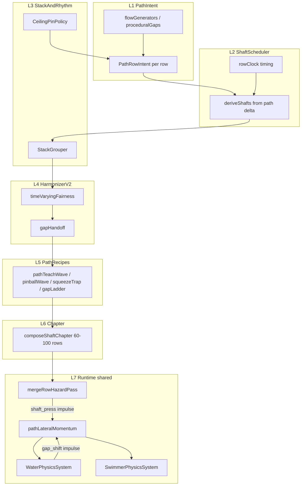

# Platform Shaft Path v2 — Design SSOT

**Status:** Authoritative (2026-07-05) — supersedes v1 recipe-event model for all new shaft work  
**Parent:** [platform-shaft-roadmap.md](./platform-shaft-roadmap.md)  
**Handoff:** [platform-shaft-path-v2-handoff.md](../visual-design/logs/platform-shaft-path-v2-handoff.md)  
**Session plan:** [platform-shaft-path-v2-session-plan.md](./platform-shaft-path-v2-session-plan.md)

---

## 1. Why v1 failed (player eyes)

What shipped (`composePressIntroShaft`, `pressPinballPair`) reads as:

> Runway. One slab from the right. Breathe. One from the left. Two thin stack rows. Release.

That is a **tutorial checklist** — five named gestures across ~34 rows, always `gapWidthCols: 2`, timed in **wall-clock seconds**. It does not feel like pinball, stack dread, or reaction rhythm.

What the founder wants reads as:

> 1-col hall opens into a **4-col room**. Left stack (3 rows) pushes right as water hits each tier — surface leans. Ceiling pin closes the side you were pushed toward, 3 rows ahead. You carry momentum into a 2-col gap on the far side. Right stack starts immediately — upper row **faster**, closes **2 cols**. Gap **above** row N is safe; gap **beside** you is a shaft. Shift diagonal. Alternation compresses to every row. Thumb never stops. 50+ shafts in one chapter.

**Root cause:** v1 authors **shafts** then carves corridors. v2 authors **paths** then derives shafts to gate them over time.

---

## 2. North star (locked)

> **Press shaft chapter** = a long directed-path curve (60–100 rows) surrounded by **dense dynamic steel** that closes the path as water rises.  
> **Player fantasy:** Wide room at first → read the path → feel water push as stacks close → steer through gap handoffs before the next wave.  
> **Static pinball** (orange blocks) = path visible upfront. **Shaft pinball** = same path intent; gates close as you move up.

**Product rules unchanged:** PS-001–PS-007, SH-005, SH-011, 6-col grid, 1 open col at narrowest, tap beats flow, hold-only slabs (no retract).

**Design mantra:** Think in **paths between shafts**, not shafts on a stage. Same tools as directed block paths; shafts are the moving walls around that path.

---

## 3. Core concepts

### 3.1 Path-first authoring

Primary artifact per row:

```typescript
type PathRowIntent = {
  row: number;
  wideGaps: number[];       // corridor before press (tunable 3–4 cols)
  narrowGaps: number[];     // corridor at full press (1 col, PS-003)
  pathCenterCol: number;    // where thumb should be when water crosses this row
  macroPhase: MacroPhase;
  staticBlocks?: number[];  // orange ceiling pins (variance)
  sectionId?: number;       // rhythm profile id; bumps after ceiling pin
};
```

- `wideGaps` = what the player sees **before** shafts move. Room to maneuver.
- `narrowGaps` = where the path **must** be at full press.
- `pathCenterCol` = directed-path center — reuse [`flowChicaneNextRow`](../../src/Game/path/flowGenerators.ts), [`generateMultiPathGapsDeterministic`](../../src/Game/path/proceduralGaps.ts), climax snaps from directed template.
- Shafts are **derived**: for each row where `wideGaps ≠ narrowGaps`, schedule a slab on the wall that eats the difference.

### 3.2 Row-clock timing (not seconds)

**Problem:** `pressDurationSec` decouples from scroll. Changing `raisingSpeed` breaks the "barely clear" feel.

**SSOT:** compose in **rows**; convert to seconds at runtime only.

```
rowDurationSec = blockHeight / raisingSpeed

pressStartRow     = shaftRow - telegraphRows(speedMul, difficulty)
pressFullRow      = shaftRow + clearanceRows(swimmerHeight, blockHeight, margin)
pressDurationRows = pressFullRow - pressStartRow

localSec = (beatRow - pressStartRow) * rowDurationSec
```

**Barely-clear invariant:** at `beatRow = pressFullRow`, press extent = 100% and swimmer tail (`y + height/2`) has just cleared slab top (`shaft.y - height/2`). Discretized:

```
clearanceRows = ceil(swimmerVisualHeight / blockHeight) + CLEARANCE_MARGIN_ROWS
```

Scroll speed changes → beat alignment holds; seconds stretch/compress automatically.

### 3.3 Rhythm, not events

Difficulty comes from **rhythmic variation**, not sparse named segments:

| Knob | Player feel |
|------|-------------|
| `speedMul` (0.8 / 1.0 / 1.2) | Same stack, upper row closes faster |
| `pressCols` (1 vs 2) | Upper tier eats 2 cols while lower holds 1 |
| `pressEase` | `ease-out` readable; `ease-in` ambush at end |
| `staggerRows` | Stack wave: row N+1 starts while row N is 40–70% extended |
| `stackDensity` | Shafts on most rows vs every 2nd row |
| Side pattern | `R, LL, RR, L, RRR, LL` — data, not hand-placed events |
| `sectionId` / rhythm profile | After ceiling pin, stacks behave differently |

Wide corridor width (`WIDE_GAP_COLS`) is tunable (default 4 easy → 3 hard) but **secondary** to speed/easing/stack rhythm.

### 3.4 Stack waves and compound flow

Adjacent same-side shafts with overlapping press windows = **stack group**:

```
stackGroup: { side, rows[], staggerRows, speedTier[], pressCols[] }
row[i].pressStartRow = stackBase + i * staggerRows
row[i].speedMul      = tier[i]   // upper faster
row[i].pressCols     = tier[i]   // e.g. [1, 1, 2]
```

Shaft stacks feed the **shared Path Lateral Momentum layer** (§3.7) — not a shaft-only accumulator.

### 3.5 Gap handoff (zig-zag path)

Survivable col in row R must be reachable from row R-1 before upper stack closes:

- Gap in row R aligns with **shaft block** in adjacent col of row R-1 → forces diagonal shift.
- Gap in row R aligns with gap in row R-1 same col → vertical chute through stack.
- Validator rejects paths where only escape requires impossible lateral distance in available beat rows.

This is SH-005 extended to **time-varying masks**, sampled every beat row.

### 3.6 Ceiling pins (variance, not constant)

Orange `staticBlocks` close the side the player was pushed toward — **sometimes**, not always.

- Seeded chance (`CEILING_PIN_CHANCE`) between shaft groups.
- Bumps `sectionId` → next shaft group uses different `RhythmProfile` (density, stagger, ease pool).
- Path recipes can **force** a pin at a beat (teach squeeze trap); policy handles ambient variance.
- **Do not** patch fair escape with ad-hoc “approach rows” or “pure escape” rows bolted onto hazards. Escape is planned in the shaft flow (see §3.8).

### 3.8 Gap-shift first — shaft flow kinds (P3 shipped)

**Core loop:** The game is **gap shifts**, not blocks. Path = where the thumb moves (gaps). Steel and ceiling pins **decorate** that path. Every shaft flow must answer: *can the player actually steer from where the stack leaves them to where the next path geometry requires?*

**Anti-pattern (rejected):** Author hazards first, then add ceiling-approach / corridor-shift / pure-escape patches when playtests fail. That produces sparse shafts, impossible pins, or wall-only autopilot.

**Pattern (SSOT):** Path row intents → **lookahead shaft flow plan** → `deriveShafts` applies passage timing on top.

#### Shaft flow kinds (`ShaftFlowKind`)

Not every chapter uses the same hazard choreography. Each kind has its own phase planner; `planShaftFlow()` dispatches.

| Kind | When | Planner |
|------|------|---------|
| `corner_stack` | Directed paths that crush swimmer to a survivor corner, then hand off to next gap | `cornerStackFlowPlan.ts` |
| `static_rest` | Teach runway / P1 path preview — wide gaps, zero steel | (no planner) |

Future kinds (pinball bounce, alternating squeeze, gap ladder) get new `ShaftFlowKind` values — **do not** overload `corner_stack`.

#### `corner_stack` segment arc (lookahead per constraint)

Between each **center constraint** (ceiling pin or path center jump), one segment is planned:

```
teach_open → escalate → peak → deescalate → gap_shift_runway → [ceiling_pin]
```

| Phase | Player eyes | Steel |
|-------|-------------|-------|
| `teach_open` | Wide room before first shaft row | None |
| `escalate` | Stack pressure builds row by row | Press ramps toward 1-col |
| `peak` | Crushed in corner — 1-col at max extension | Max press (multiple rows OK) |
| `deescalate` | Lane opens — each next slab extends **less** | Decreasing `pressCols` (still steel; taps to steer) |
| `gap_shift_runway` | Final wide breath before geometry change | Zero steel |
| `ceiling_pin` | Orange blocks close pushed side | Static rest row |

**Gap-shift budget:** `driftCols × GAP_SHIFT_ROWS_PER_COL` wide rows required before a center constraint. Deescalate rows are steel that *opens* the lane; `gap_shift_runway` is zero steel only for the last cols of lateral drift. Same invariant as chicane: ~**1 col lateral move per 3 wide rows** (`flowGenerators` / `gapShiftPlan.ts`).

**Key modules:**

| Module | Role |
|--------|------|
| `pathIntent/gapShiftPlan.ts` | `nextCenterConstraintRow`, drift budget helpers |
| `shaftScheduler/shaftFlowTypes.ts` | `ShaftFlowKind`, `CornerStackPhase`, typed row plans |
| `shaftScheduler/cornerStackFlowPlan.ts` | Lookahead segment planner |
| `shaftScheduler/planShaftFlow.ts` | Dispatch by flow kind |
| `shaftScheduler/deriveShafts.ts` | Passage-aware hazard commit |
| `composePathChicaneShaft.ts` | `pathChicane` path + `corner_stack` derive; meta.`shaftFlowKind` |

**Tuning (corner_stack):** `GAP_SHIFT_ROWS_PER_COL`, `GAP_SHIFT_MIN_OPEN_COLS`, `SHAFT_BUILD_ROWS_MIN_EASY/HARD`, `SHAFT_PEAK_HOLD_ROWS`, `PATH_SHAFT_START_ROW`.

**Runtime note (2026-07):** Hazard-band vanish at loop rollover fixed in spawn/merge/grid — see handoff. Dev dump: `platformShaftVanishDiag.ts`.

### 3.7 Path Lateral Momentum (shared — static rows + shafts)

**Founder intent:** consecutive rows shifting the gap the same direction (chicane run, pinball drift, shaft stack) should **build momentum** — water bulges that side, surface leans, swimmer carries velocity, **counter-steer costs more power**. This must work on **existing static block rows** and on shaft chapters through one structured API — not two parallel flow hacks.

**What exists today (partial):**
- [`WaterPhysicsSystem.ts`](../../src/systems/PhysicsSystem/WaterPhysicsSystem.ts) — per-range `flowPerRange` from row-to-row gap center delta; drag via `waterPhysicsTuning.FLOW_DRAG_PER_SECOND`.
- [`mergeRowHazardPass.ts`](../../src/Game/grid/mergeRowHazardPass.ts) — additive `platformFlowPerRange` from active shaft press (PS-007).
- [`SwimmerPhysicsSystem.ts`](../../src/systems/PhysicsSystem/SwimmerPhysicsSystem.ts) — `localFlow` → `waterCurrentVelocityX`; tap steer largely independent of built momentum.

**Gap:** no **run-length accumulation** when N consecutive rows shift the same sign; shaft flow and gap-shift flow are separate channels; no **steer resistance** fighting momentum.

**New shared module:** `src/Game/water/pathLateralMomentum.ts`

```typescript
type LateralImpulseSource = 'gap_shift' | 'shaft_press' | 'gap_narrow';

type LateralImpulse = {
  source: LateralImpulseSource;
  direction: -1 | 1;       // push right (+1) or left (-1)
  strength: number;        // 0..1 normalized
  rowIndex?: number;
};

type PathLateralMomentumState = {
  momentumNorm: number;    // -1..1 signed carry
  runLength: number;       // consecutive same-sign impulses
  lastSign: -1 | 0 | 1;
};

// Per frame / row transition:
stepPathLateralMomentum(prev, impulse, dt) => {
  if (impulse.direction === prev.lastSign) runLength++;
  else runLength = 1;
  const runBonus = 1 + (runLength - 1) * MOMENTUM_RUN_BONUS_PER_ROW;  // chicane: 5 rows same way = stronger
  const target = impulse.direction * impulse.strength * runBonus;
  momentumNorm = lerp(prev.momentumNorm, target, ACCEL) * exp(-DRAG * dt);
  return { momentumNorm, runLength, lastSign: impulse.direction };
}
```

**Impulse sources (same API):**

| Source | When | Strength from |
|--------|------|---------------|
| `gap_shift` | Row cross; gap center moved vs prev row | `deltaCols / gapWidth` (already computed in WaterPhysicsSystem) |
| `gap_narrow` | Same row, gap width shrinking | narrowing factor (chute squeeze) |
| `shaft_press` | Active platform press on band row | PS-007 `flowNormFromPressVelocity` |

**Consumers (one momentum value, three outputs):**

| System | Effect |
|--------|--------|
| **WaterPhysicsSystem** | Add `momentumNorm` to `flowVelocity` / `flowPerRange`; scale `surgeEnergy`, `surfaceCurveCenterNorm` offset (bulge toward push side), shader lean |
| **SwimmerPhysicsSystem** | Add `momentumNorm * MOMENTUM_PUSH_GAIN` to horizontal velocity; **steer resistance**: tap impulse × `(1 - abs(momentum) * COUNTER_STEER_COST)` when tap opposes momentum |
| **Water shader / foam** | Existing `uFlowVelocity`, `uSurge`, `uCurveCenter` — driven harder when `runLength >= 2` |

**Player feel:**
- 3-row chicane drifting right on static orange blocks → water surface visibly bulges right, swimmer coasts right, left tap feels **heavier** until momentum decays.
- Shaft stack on same side → same bulge + push stacks with gap_shift impulses during overlap.
- Direction flip (chicane bounce) → `runLength` resets; brief window where old momentum fights new path — intentional pinball read.

**Compose-time (optional):** `PathRowIntent` may carry `expectedMomentumRun` for lab preview / tuning overlay only. Runtime always derives from actual geometry + shaft phase.

**Ship order:** P6a static-row momentum first (benefits **all directed paths immediately**); P6b shaft impulses into same module.

---

## 4. Architecture



### Keep (extend)

| Module | Role |
|--------|------|
| [`harmonizer.ts`](../../src/Game/path/platformShaft/harmonizer.ts) | `capPressCols` PS-003/004 |
| [`platformPressMotion.ts`](../../src/Game/hazards/platformPressMotion.ts) | Easing; add row-clock duration |
| [`mergeRowHazardPass.ts`](../../src/Game/grid/mergeRowHazardPass.ts) | Per-frame mask + flow hook |
| [`flowFromPlatform.ts`](../../src/Game/hazards/flowFromPlatform.ts) | PS-007 per slab |
| [`platformShaftRowPathTemplate.ts`](../../src/Game/path/platformShaft/platformShaftRowPathTemplate.ts) | Streaming |
| Dev locks / Storybook / App.tsx | Same prop surface during migration |
| [`scripts/stage-design-lab/`](../../scripts/stage-design-lab/) | Lab PNG + fairness loop |

### Deprecate (after v2 parity)

| Module | Why |
|--------|-----|
| [`recipeCompose.ts`](../../src/Game/path/platformShaft/recipeCompose.ts) `appendSlabEvent` | Event-script model |
| `pressDurationSec` as compose primary | Row-clock replaces |
| `hazards >= 5` acceptance | Density ratio replaces |
| [`pressPinballPair.ts`](../../src/Game/path/platformShaft/recipes/pressPinballPair.ts) internals | Replaced by `pathPinballWave` |

---

## 5. Module layout (engine)

```
src/Game/path/platformShaft/
  pathIntent/
    types.ts
    pathGenerators.ts       # chicane, chute, narrow-entry, multi-gap
    ceilingPinPolicy.ts
  shaftScheduler/
    rowClock.ts
    shaftFlowTypes.ts         # ShaftFlowKind, CornerStackPhase
    cornerStackFlowPlan.ts    # corner_stack lookahead
    planShaftFlow.ts          # dispatch by flow kind
    deriveShafts.ts
    passagePlanner.ts
    stackGrouper.ts           # (future P4)
  pathIntent/
    gapShiftPlan.ts           # drift budget, center constraints
  harmonizerV2/
    timeVaryingFairness.ts
    gapHandoff.ts
  pathRecipes/
    pathTeachWave.ts
    pathPinballWave.ts
    pathSqueezeTrap.ts
    pathGapLadder.ts
  composeShaftChapter.ts
  # existing: harmonizer.ts, primitives.ts, types.ts (extended)

src/Game/water/
  pathLateralMomentum.ts    # SHARED — static gap runs + shaft presses
```

**Lab mirror:** `scripts/stage-design-lab/path-shaft-generators.js` — every engine module gets a JS twin for PNG/fairness without device.

---

## 6. Path recipes (replaces v1 recipe catalog)

| Recipe ID | 3s read | Path mix | Rows | Hazards (target) |
|-----------|---------|----------|------|------------------|
| `pathTeachWave` | "Wide room, path drifts, first stack tease" | 1-col entry → 4-col chicane → single-side stack | 40–50 | 12–18 |
| `pathPinballWave` | "Bounced left-right, never settles" | chicane drift + alternating stack waves | 50–70 | 25–35 |
| `pathSqueezeTrap` | "Pushed into a closing side" | ceiling pin sections + opposite stacks | 50–70 | 25–35 |
| `pathGapLadder` | "Shift up through gaps beside shafts" | multi-gap handoff zig-zag, speed tiers | 60–80 | 30–45 |

**Chapter compositions (P8):** same chapter IDs as roadmap (`pressPinballShaft`, etc.) — new internals, old Storybook prop names kept via wrappers until P9.

---

## 7. Tuning keys (`platformShaftTuning.ts`)

All knobs in one SSOT. v2 keys to add:

| Key | Default (starting point) | Controls |
|-----|--------------------------|----------|
| `WIDE_GAP_COLS_EASY` | 4 | Unextended corridor width |
| `WIDE_GAP_COLS_HARD` | 3 | Hard lerp target |
| `NARROW_GAP_COLS` | 1 | PS-003 |
| `CLEARANCE_MARGIN_ROWS` | 1 | Forgiveness beyond swimmer height |
| `TELEGRAPH_ROWS_EASY/HARD` | 3 / 1 | Lead before press start |
| `STACK_STAGGER_ROWS_EASY/HARD` | 1 / 0 | Within-stack offset |
| `SPEED_TIER_SLOW` | 1.25 | Slower press (more rows) |
| `SPEED_TIER_NORM` | 1.0 | Baseline |
| `SPEED_TIER_FAST` | 0.75 | Faster press (fewer rows) |
| `CEILING_PIN_CHANCE` | 0.15 | Section-break probability |
| `CEILING_PIN_LEAD_ROWS` | 3 | Pin ahead of stack end |
| `MOMENTUM_DRAG_PER_SECOND` | 0.07 | Shared with `waterPhysicsTuning` baseline |
| `MOMENTUM_ACCEL_PER_SECOND` | 6 | Response to new impulse |
| `MOMENTUM_RUN_BONUS_PER_ROW` | 0.12 | Extra push per consecutive same-sign row |
| `MOMENTUM_PUSH_GAIN` | 1.0 | Swimmer horizontal carry from momentum |
| `COUNTER_STEER_COST` | 0.45 | Tap opposing momentum feels heavier (0=none, 1=full block) |
| `MOMENTUM_VISUAL_BULGE_GAIN` | 1.2 | Surface curve / surge scale from runLength |
| `SHAFT_IMPULSE_GAIN` | 1.0 | PS-007 into shared momentum (was FLOW_STACK_BONUS) |
| `RHYTHM_PROFILE_DEFAULT_DENSITY` | 0.85 | Fraction of rows with shafts |
| `RHYTHM_PROFILE_POST_PIN_DENSITY` | 1.0 | After ceiling pin section |
| `GAP_SHIFT_ROWS_PER_COL` | 3 | Wide rows per col of lateral drift before constraint |
| `GAP_SHIFT_MIN_OPEN_COLS` | 3 | Min open cols counting as gap-shift runway |
| `SHAFT_BUILD_ROWS_MIN_EASY/HARD` | 5 / 3 | Min escalate rows per corner_stack segment |
| `SHAFT_PEAK_HOLD_ROWS` | 2 | Hold max 1-col press at stack peak |
| `PATH_SHAFT_START_ROW` | 8 | Teach runway before first steel |

---

## 8. Acceptance criteria

### Per-slice exits

| Slice | Exit test |
|-------|-----------|
| P1 | Lab PNG: 40-row chicane, wide gaps, path overlay, zero steel; founder confirms "room to move" |
| P2 | Headless: same `pressDurationRows` → full press at same beat row at 200 and 400 px/s |
| P3 | Storybook: shafts close row-by-row; hazards/rows ≥ 0.5 on 40-row segment |
| P4 | Lab scrub: 3-row stack, upper faster + 2-col press visible |
| P5 | `fairnessReport.ok` on 60-row dense segment at speeds 200, 300, 400 |
| P6a | Directed chicane: 3+ same-direction rows → bulge + swimmer carry + heavier counter-tap |
| P6b | Shaft stack impulses sum into same momentum; fight ceiling pin |
| P7 | Non-dev names each recipe gesture in 3s |
| P8 | 80+ row chapter survivable; stage 2+ pool draw |

### Metrics (replace v1 hazard count)

```
hazards / rows >= 0.4        // tension chapters
minGapCols == 1              // at every sampled beat row at full press
fairnessReport.ok            // time-varying SH-005
gapHandoff.valid             // zig-zag fixtures pass
```

---

## 9. Implementation slices P0–P9

See [platform-shaft-path-v2-session-plan.md](./platform-shaft-path-v2-session-plan.md) for **session grouping** and copy-paste prompts.

| Slice | Summary |
|-------|---------|
| **P0** | This doc + roadmap re-scope + tuning stubs + handoff |
| **P1** | PathRowIntent + pathGenerators + ceilingPinPolicy + lab path PNG |
| **P2** | rowClock + platformPressMotion row-clock + scroll invariance tests |
| **P3** | deriveShafts + `corner_stack` flow + Storybook loop | **Shipped** — `composePathChicaneShaft`, `cornerStackFlowPlan` |
| **P4** | stackGrouper + RhythmProfile per sectionId |
| **P5** | harmonizerV2 time-varying + gapHandoff + lab fairness |
| **P6** | `pathLateralMomentum.ts` — P6a static chicane runs, P6b shaft impulses; Water + Swimmer wire |
| **P7** | Four path recipes + Storybook + lab buttons |
| **P8** | composeShaftChapter + stageChapterPools |
| **P9** | Remove appendSlabEvent; wrapper migration; test cleanup |

**Dependency:** P0 → P1 → P2 → P3 → (P4 ∥ P5) → P6 → P7 → P8 → P9

---

## 10. Visual scenarios (reference for implementers)

### Scenario A — Pinball wave (founder description)

1. Enter 1-col hall → open 4-col room.
2. Left stack (3 rows, stagger 1): water hits row 0 → push begins; rows 1–2 compound flow.
3. Ceiling pin on right side, 3 rows ahead of stack end.
4. Momentum + new right stack (2 rows; upper `speedMul=0.75`, `pressCols=2`).
5. 2-col gap on far left — player dives there.
6. Gap handoff: safe col in row R+1 is diagonal from R.
7. Alternation accelerates; breathe rows removed in hard band.

### Scenario B — Gap ladder

- Row R: 1-col gap col 2; col 3 is shaft from left at full press.
- Row R+1: 1-col gap col 3; col 2 is shaft from right starting.
- Row R+2: space row (wide both sides).
- Row R+3,R+4: 2-row stack same side pushing to opposite.
- Player reads **path nodes**, not individual slabs.

---

## 11. Migration from v1

| v1 | v2 transition |
|----|---------------|
| `composePressIntroShaft` | Thin wrapper → `pathTeachWave` (P9) |
| `pressPinballPair` | Replace with `pathPinballWave` |
| `storyLockedShaftRecipe` props | Unchanged until P7; add new recipe ids to union |
| Lab "Insert press intro shaft" | Add "Insert path preview" (P1), then "Insert path teach wave" (P7) |
| Existing harmonizer tests | Keep; harmonizerV2 adds parallel suite |

---

## 12. Document changelog

| Date | Change |
|------|--------|
| 2026-07-05 | v2.0 — Path-first SSOT: founder vision, row-clock, dense shafts, gap handoff, session plan link |
| 2026-07-05 | v2.1 — §3.7 Path Lateral Momentum: shared static+shaft layer, run-length accumulation, counter-steer cost |

---

*When a slice ships: check session plan, append handoff log, tune in `platformShaftTuning.ts`.*
