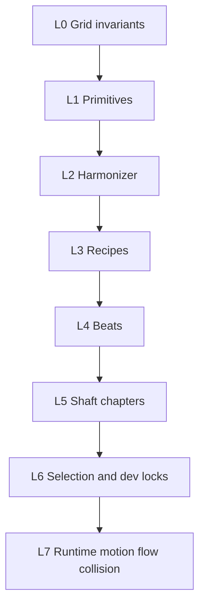

# Platform Shaft — Implementation Roadmap

**Status:** Draft v1.0 (2026-07-04) — **authoritative blueprint** for one-sided steel platform (`hazard_platform`) press-shaft chapters  
**v2 path-first redesign:** [platform-shaft-path-v2-spec.md](./platform-shaft-path-v2-spec.md) — supersedes v1 recipe-event composers (S4 `pressPinballPair` etc.) for new work. Slices P0–P9 in session plan.
**Audience:** Founder, implementers, future agent sessions  
**Parent doc:** [stage-hazard-progression-roadmap.md](./stage-hazard-progression-roadmap.md) — stage chapter model, SH-005 fairness, SH-011 machinery art  
**Reference handoff:** [stage-composer-exports/one-sided-platforms-variations/](../../stage-composer-exports/one-sided-platforms-variations/) (JSON + PNG + prompt)

**Companion docs (do not duplicate — link and extend):**

| Doc | Owns |
|-----|------|
| [stage-hazard-progression-roadmap.md](./stage-hazard-progression-roadmap.md) | Stage chapters, hazard catalog, survival heat, grid SSOT |
| [run-level-progression.md](./run-level-progression.md) | Run blueprint, opening archetypes — future shaft pool weights |
| [../../src/Layout.ts](../../src/Layout.ts) | `LAYOUT_CONSTANTS.COLUMNS = 6` |
| [../../scripts/stage-design-lab/](../../scripts/stage-design-lab/) | Lab sim, fairness linter, PNG export loop |
| [platform-shaft-path-v2-spec.md](./platform-shaft-path-v2-spec.md) | Path-first v2 SSOT — PathRowIntent, row-clock, dense shafts |
| [platform-shaft-path-v2-session-plan.md](./platform-shaft-path-v2-session-plan.md) | v2 session grouping + implementation prompts |

---

## 0. How to use this document

1. **Read [stage-hazard-progression-roadmap.md](./stage-hazard-progression-roadmap.md) §2** before coding — press shafts obey SH-005, SH-011, and stage chapter rules.
2. **Pick one slice** from §9 — ship **visual test pass** before starting the next slice.
3. **Update checkboxes** in §9 when a slice ships.
4. **Append handoff** under `docs/visual-design/logs/platform-shaft-s{N}-*-handoff.md` per [ai-handoff-protocol.md](../visual-design/ai-handoff-protocol.md).
5. **Lab first, engine second** — prove recipes + fairness in stage-design-lab before ObstacleSystem wiring.

---

## 1. North star — product rule (locked)

> **Press shaft** = one full directed-path loop (FLOW → TENSION → CLIMAX → RELEASE) whose **signature hazard** is **one-sided steel platforms** that press inward, hold, and squeeze water to **one open column** on a **6-column grid**.  
> **Player fantasy:** Read the metal slab telegraph → pre-position in the shrinking lane → feel water push as the gap tightens → slide to the safe side before the next slab — pin crisis if late.  
> **Not the fantasy:** Full seal against opposite orange blocks (requires multi-layer water — deferred); two open columns at narrowest (reads as wide chute, not squeeze on 6 cols).

**One-sentence read at 64px width:**

> Cool **steel slab** slides in from one wall — water channel snaps to **one column** — thumb steers through or gets pinned.

---

## 2. Locked design decisions

| ID | Decision | Rationale | Invalidates |
|----|----------|-----------|-------------|
| **PS-001** | Slabs **press and hold** — no retract stroke in v1 | Positions matter for water spread/compression over time | Jelly Jump return stroke |
| **PS-002** | **Never full seal** against opposite orange blocks | Single 2D water surface — zero gap = no water path without layered fluid (PS-TODO-001) | Slab flush against far wall |
| **PS-003** | **`minResidualGapCols = 1`** on 6-col grid | One open col at narrowest = real squeeze; **2 open cols does not read as danger** at this width | Teaching with 2-col residual minimum |
| **PS-004** | `pressCols` capped: `gapWidthAtRest - oppositeWallInset - minResidualGapCols` | Harmonizer enforces PS-002 + PS-003 | Hand-tuned pressCols that fail fairness |
| **PS-005** | Machinery art only (SH-011) | Steel slab ≠ orange clay blocks | Animating orange block sprites for motion |
| **PS-006** | Shaft chapters **pool-drawn** (stage 2+), not fixed stage numbers | Future blueprint randomization; test via dev lock props | "Stage 3 = Press Shaft" forever |
| **PS-007** | Flow force ∝ **rowSpan × press velocity × 1/gapWidth** | Tighter + taller + faster = stronger lateral push | Flat flow unrelated to squeeze |

---

## 3. Architecture layers



| Layer | Module (proposed) | Responsibility |
|-------|-------------------|----------------|
| **L0** | `Layout.ts`, fairness rules | 6 cols; SH-005 overlap ≥ 1; min residual gap 1 col |
| **L1** | `platformShaft/primitives.ts` | Corridor slices, slab specs, flow field slices |
| **L2** | `platformShaft/harmonizer.ts` | Cap pressCols, stagger timing, fairness reroll |
| **L3** | `platformShaft/recipes/*.ts` | Named behaviors (teach, pinball, stack, …) |
| **L4** | `platformShaft/composeBeat.ts` | Macro-phase segment = 1–3 recipes + glue |
| **L5** | `platformShaft/composeShaftChapter.ts` | Full FLOW→RELEASE loop |
| **L6** | `stageChapterPools.ts`, Storybook/App props | Production draw + dev visual locks |
| **L7** | `mergeRowHazardPass.ts`, `flowFromPlatform.ts` | Timed masks, `Water.platformFlowPerRange`, collision |

**Render split (SH-011):**

```
ObstacleRow (static)   → orange clay → pin / ceiling
HazardBandLead on ObstacleRow (dynamic) → steel slab  → stage press gimmick
```

---

## 4. Recipe catalog

**Fun / progression / variability:** [platform-shaft-recipe-fun-spec.md](./platform-shaft-recipe-fun-spec.md)

| Recipe ID | Player read | Key vars | Macro phase |
|-----------|-------------|----------|-------------|
| `pressTeachSingle` | One metal wall slides in | tall `rowSpan`, ease-out, long telegraph, `pressCols=1` | FLOW |
| `pressPinballPair` | Bounced left, then right | alternate sides, chicane drift | TENSION |
| `pressStackCascade` | Jelly Jump stairs | `rowSpan=1`, staggered `animStartRow` | TENSION / CLIMAX |
| `pressOppositeWall` | Far wall blocked — hug near side | `oppositeWallBlocks` + capped press | TENSION |
| `pressTandem` | Two machines, overlapping windows | two slabs, offset timing | CLIMAX |
| `pressBreather` | Wide corridor, slow press | `pressCols=1`, long duration | RELEASE |
| `pressMixedBeat` | Lab handoff strip | multi-recipe sequence | FLOW teach export |

Each recipe returns:

```typescript
type RecipeOutput = {
  staticRows: RowDef[];
  hazards: PlatformSlab[];
  flowSlices: FlowFieldSlice[];
  markers: Marker[];
  meta: { recipeId: string; difficultyBand: 'easy' | 'mid' | 'hard' };
};
```

---

## 5. Harmonizer + fairness

**SH-005:** At every sampled time `t`, row→row gap overlap ≥ 1 col (same as [fairness-v2.js](../../scripts/stage-design-lab/fairness-v2.js)).

**PS-003 / PS-004:** At full press:

```
maxPressCols = gapWidthAtRest - oppositeWallInset - minResidualGapCols
effectivePressCols = min(requestedPressCols, maxPressCols)
```

**Deterministic reroll order** when fairness fails:

1. Reduce `pressCols`
2. Increase `pressDurationSec`
3. Increase telegraph lead (`animStartRow` earlier)
4. Widen static corridor
5. Bump seed → alternate recipe from same beat pool

**Lab reference:** [hazard-sim.js](../../scripts/stage-design-lab/hazard-sim.js) `simPlatform`, `applyPressEase`.

---

## 6. Flow force model

Per active slab at time `t`:

```
pressVelocity = d(pressExtent)/dt   // from ease curve + pressDurationSec
heightFactor  = rowSpan / maxRowSpan
tightnessFactor = 1 / max(1, gapWidthCols)
flowNorm = sign(intoWater) × heightFactor × tightnessFactor × velocityFactor × baseGain
flowNorm = clamp(flowNorm, -flowMaxNorm, flowMaxNorm)
```

**Runtime hook:** `mergeRowHazardPass` → `Water.platformFlowPerRange` (quadrant sampling in [SwimmerPhysicsSystem.ts](../../src/systems/PhysicsSystem/SwimmerPhysicsSystem.ts)).

**Shader:** gap width + flow already drive pressure foam in `waterShader.ts` — free readability when flow is wired.

**Pinned:** respect `PINNED_BLOCK_WATER_CURRENT_ADVECTION`; tap still wins on cheap phones.

---

## 7. Dev visual test harness

Mirror [storyLockedProceduralSegment](../../src/Game/ecs-systems/obstacleSystem.ts) pattern from [Swimmer.stories.tsx](../../src/containers/ReactNativeSkiaGameEngine/Swimmer.stories.tsx) `LockedPathFunnelLoop`.

### Props (Slice 2+)

| Prop | Type | Purpose |
|------|------|---------|
| `storyLockedShaftRecipe` | `StoryLockedShaftRecipe` | Lock one recipe loop |
| `storyLockedShaftSeed` | `number` | Deterministic harmonizer reroll |
| `storyLockedShaftDifficulty` | `0..1` | Override difficulty profile |
| `storyLockShaftLoop` | `boolean` | Repeat same beat on restart |

### Visual test matrix

| Slice | Storybook story | App.tsx props | Pass criteria |
|-------|-----------------|---------------|---------------|
| S0 | — | — | Doc + links exist |
| S1 | Lab export PNG | — | `fairnessReport.ok`; **1-col** narrowest gap |
| S1.5 | **Insert press intro shaft** | — | ≥4 slabs, ≥34 rows; full teach arc |
| S2 | `LockedPressIntroShaftLoop` | `storyLockedShaftRecipe="composePressIntroShaft"` | Loop restarts intro shaft |
| S3 | same | same | Slab visible (machinery art) |
| S4 | `LockedPressPinballLoop`, `LockedPressStackLoop`, `LockedPressSqueezeLoop`, `LockedPressMixedLoop` | recipe id per test | Each read distinct in 3s |
| S5 | `LockedPressStackLoop` | + flow tuning | Push felt when gap tightens |
| S6 | `LockedPressMixedShaftLoop` | — | Full chapter arc + overlay name |
| S7 | (no lock) directed run | — | Stage 2+ random press shaft |

### App.tsx example (Slice 2+)

```tsx
<SwimmerGameComp
  lockedTemplateName="directed"
  storyLockedShaftRecipe="composePressIntroShaft"
  storyLockedShaftSeed={42}
  storyLockedShaftDifficulty={0.4}
  storyLockShaftLoop={true}
/>
```

---

## 8. Stage chapter pools

Shaft chapters are **not** fixed to a stage number. Production draws from a pool:

```typescript
type ShaftChapterId =
  | 'pressPinballShaft'
  | 'pressStackShaft'
  | 'pressSqueezeShaft'
  | 'pressMixedShaft';

type StageChapterPool = {
  stageIndexMin: number;  // first appearance: 2
  weights: Partial<Record<ShaftChapterId, number>>;
  mixWithStaticShafts: boolean;
};
```

| Chapter ID | Display name | Beat mix |
|------------|--------------|----------|
| `pressPinballShaft` | Pinball Press | teach → pinball pair → breather |
| `pressStackShaft` | Stack Shaft | teach → stack cascade → tandem |
| `pressSqueezeShaft` | Squeeze Shaft | opposite-wall → stack → breather |
| `pressMixedShaft` | Mixed Press | handoff-style variation strip |

Future: [runBlueprint.ts](../../src/Game/path/runBlueprint.ts) biases weights per run — Slice 7 basic pool only.

---

## 9. Implementation slices

```
Slice 0 Doc ──► Slice 1 Lab ──► Slice 1.5 Intro shaft ──► Slice 2 Dev locks ──► Slice 3 Teach engine
                                                      │
Slice 7 Stage pool ◄── Slice 6 Chapter ◄── Slice 5 Motion+flow ◄── Slice 4 Recipes
```

### Slice 0 — Roadmap doc + grid doc fix

**Goal:** SSOT exists; main hazard doc links here.

| Task | Exit | Done |
|------|------|------|
| S0.1 Create this document §0–§11 | Doc complete | [x] |
| S0.2 Link from stage-hazard-progression-roadmap.md | Cross-links grep clean | [x] |
| S0.3 Fix 8→6 col in hazard path docs | No stale 8-column SSOT | [x] |
| S0.4 `platformShaftTODO.ts` backlog anchor | Code stub with PS-TODO flags | [x] |

**Visual test:** N/A (doc only).

**Handoff:** [platform-shaft-s0-doc-handoff.md](../visual-design/logs/platform-shaft-s0-doc-handoff.md)

---

### Slice 1 — Lab harmonizer + first recipe

**Goal:** Procedural generation + fairness loop in stage-design-lab.

| Task | Exit | Done |
|------|------|------|
| S1.1 `hazard-generators.js` — `pressTeachSingle`, `capPressCols`, `harmonizePlatformBeat` | Valid JSON on reroll | [x] |
| S1.2 Rename `6of8`/`2of8` → `widePreset`/`narrowPreset` | Iris presets scale on 6 cols | [x] |
| S1.3 Fairness messaging for minResidualGapCols = 1 | Clear fail when press over-capped | [x] |
| S1.4 `src/Game/path/platformShaft/harmonizer.ts` + unit tests | Headless tests pass | [x] |

**Visual test:** stage-design-lab → **Insert press teach** → PNG + JSON → `fairnessReport.ok === true`, **1 col** at narrowest. *(Atom only — see Slice 1.5 for player-facing intro segment.)*

**Handoff:** [platform-shaft-s1-lab-handoff.md](../visual-design/logs/platform-shaft-s1-lab-handoff.md)

---

### Slice 1.5 — composePressIntroShaft (teach segment)

**Goal:** Lab button inserts a **multi-slab intro shaft** (~34+ rows, 5 hazards), not the one-slab atom.

| Task | Exit | Done |
|------|------|------|
| S1.5.1 `composePressIntroShaft` + corridor/slab builders | ≥4 hazards, fairness ok | [x] |
| S1.5.2 Retarget lab UI → **Insert press intro shaft** | Button + status show row/hazard counts | [x] |
| S1.5.3 `INTRO_SHAFT_*` tuning keys | Doc parity in `platformShaftTuning.ts` | [x] |
| S1.5.4 Headless verify | `rows ≥ 34`, `hazards ≥ 4`, `minGap === 1` | [x] |

**Atoms vs composers:** `pressTeachSingle` stays for harmonizer unit tests only. Players and dev locks use `composePressIntroShaft`.

**Visual test:** stage-design-lab → **Insert press intro shaft** → scrub: safe runway → 2 opposite presses → stack tease → climax → release. Export → `fairnessReport.ok === true`, **1 col** at narrowest.

**Handoff:** [platform-shaft-s1-lab-handoff.md](../visual-design/logs/platform-shaft-s1-lab-handoff.md) §1.5

---

### Slice 2 — Dev visual lock props

**Goal:** Device / Storybook loop without stage routing.

| Task | Exit | Done |
|------|------|------|
| S2.1 `StoryLockedShaftRecipe` union in obstacleSystem.ts | Type exported | [x] |
| S2.2 ObstaclesManager shaft lock props | Props on manager | [x] |
| S2.3 Swimmer.stories `LockedPressIntroShaftLoop` | Storybook dropdown | [x] |
| S2.4 App.tsx pass-through | Device reload → same beat | [x] |

**Visual test:** Storybook + App.tsx — **intro shaft** (safe runway → multiple slabs → release), gap narrows to **1 col**, survivable with steer. Loop `composePressIntroShaft`, not `pressTeachSingle`.

**Handoff:** `docs/visual-design/logs/platform-shaft-s2-dev-lock-handoff.md`

---

### Slice 3 — Engine: teach recipe + streaming

**Goal:** First recipe streams in ObstacleSystem.

| Task | Exit | Done |
|------|------|------|
| S3.1 `src/config/platformShaftTuning.ts` | minResidualGapCols: 1 | [x] |
| S3.2 `recipes/pressTeachSingle.ts` | RecipeOutput | [x] |
| S3.3 Wire `storyLockedShaftRecipe` in ObstacleSystem | Locked story spawns segment | [x] |
| S3.4 ~~Machinery render stub~~ | **Deferred → Slice 5** (`MovingHazard`) | [ ] |

**Visual test:** `LockedPressIntroShaftLoop` — intro shaft **corridor layout** (runway, chicane, 2-col chute, release). Steel + 1-col squeeze = **Slice 5** ([moving-hazard-system-architecture.md](./moving-hazard-system-architecture.md)).

**Handoff:** `docs/visual-design/logs/platform-shaft-s3-teach-handoff.md`

---

### Slice 4 — Recipes: pinball, stack, opposite-wall, mixed

**Goal:** Four distinct reads; each gets locked story.

| Task | Exit | Done |
|------|------|------|
| S4.1 Lab + engine: `pressPinballPair` | `LockedPressPinballLoop` | [x] |
| S4.2 Lab + engine: `pressStackCascade` | `LockedPressStackLoop` | [ ] |
| S4.3 Lab + engine: `pressOppositeWall` | `LockedPressSqueezeLoop` | [ ] |
| S4.4 Lab + engine: `pressMixedBeat` | `LockedPressMixedLoop` | [ ] |

**Handoff:** `docs/visual-design/logs/platform-shaft-s4-recipes-handoff.md`

---

### Slice 5 — mergeRowHazardPass + flow force

**Goal:** Timed masks + water push feel.

| Task | Exit | Done |
|------|------|------|
| S5.1 `HazardBandLead` + `mergeRowHazardPass.ts` | Per-frame effective mask on member rows | [x] |
| S5.2 `flowFromPlatform.ts` → `Water.platformFlowPerRange` | Lateral drift on squeeze | [x] |
| S5.3 Flow tuning in platformShaftTuning | rowSpan × velocity × tightness | [x] |

**Visual test:** Stack cascade — push increases as gap 3→2→**1** col.

**Handoff:** `docs/visual-design/logs/platform-shaft-s5-motion-flow-handoff.md`

---

### Slice 6 — Shaft chapter composer

**Goal:** Full FLOW→RELEASE loop per press-shaft chapter.

| Task | Exit | Done |
|------|------|------|
| S6.1 `composeShaftChapter.ts` | 32+ row chapter | [ ] |
| S6.2 Chapter IDs + display names + tint tokens | Four shaft types | [ ] |
| S6.3 `LockedPressMixedShaftLoop` story | Full handoff-like strip | [ ] |

**Handoff:** `docs/visual-design/logs/platform-shaft-s6-chapter-handoff.md`

---

### Slice 7 — Stage chapter pool

**Goal:** Random shaft selection stage 2+.

| Task | Exit | Done |
|------|------|------|
| S7.1 `stageChapterPools.ts` — weights, stageIndexMin: 2 | Press shafts in pool | [ ] |
| S7.2 StageOverlaySystem display names | HUD shows shaft name | [ ] |
| S7.3 Headless fairness at S1–S4 speeds | No impossible timed rows | [ ] |

**Visual test:** Normal run — stage 2+ sometimes press shaft; stage 1 never.

**Handoff:** `docs/visual-design/logs/platform-shaft-s7-pool-handoff.md`

---

## 10. Backlog / deferred (PS-TODO)

| ID | Item | Why deferred | Code anchor |
|----|------|--------------|-------------|
| **PS-TODO-001** | Multi-layer water surface (slab + swimmer same layer; water passes under/over) | Performance + visual scope; enables true seal | `platformShaftTODO.ts` |
| **PS-TODO-002** | Sharp hazards on **opposite static blocks** | Danger without full closure; extends `SharpObstacle` | `platformShaftTODO.ts` |
| **PS-TODO-003** | Sharp teeth on **slab face** | Moving hitbox + scrape policy | `platformShaftTODO.ts` |
| **PS-TODO-004** | Slab retract stroke | Founder locked hold-only (PS-001) | — |
| **PS-TODO-005** | Run blueprint weight biasing for shaft pool | Defer to run-level-progression Phase 2 | `runBlueprint.ts` |

---

## 11. Document changelog

| Date | Change |
|------|--------|
| 2026-07-04 | v1.0 — Initial roadmap: PS-001–PS-007, 7 implementation slices, visual test matrix, harmonizer rules, flow model, dev lock harness, chapter pools, PS-TODO backlog |
| 2026-07-04 | v1.1 — **Slice 1 shipped:** lab `pressTeachSingle`, harmonizer, `widePreset`/`narrowPreset`, fairness hints, engine harmonizer + tests |
| 2026-07-04 | v1.2 — **Slice 1.5 shipped:** `composePressIntroShaft`, lab **Insert press intro shaft**, `INTRO_SHAFT_*` tuning |
| 2026-07-04 | v1.5 — **Slice 3 corrected:** path-only streaming; machinery stub removed; [moving-hazard-system-architecture.md](./moving-hazard-system-architecture.md) for L7 |
| 2026-07-04 | v1.4 — ~~Slice 3 machinery stub~~ superseded by v1.5 |
| 2026-07-04 | v1.3 — **Slice 2 shipped:** `StoryLockedShaftRecipe`, ObstaclesManager shaft lock props, `LockedPressIntroShaftLoop`, App.tsx pass-through |

---

*When a slice ships, check boxes in §9, append handoff under `docs/visual-design/logs/`, tune in `platformShaftTuning.ts` — not in praise detectors alone.*
