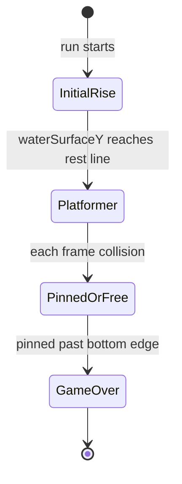
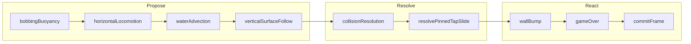
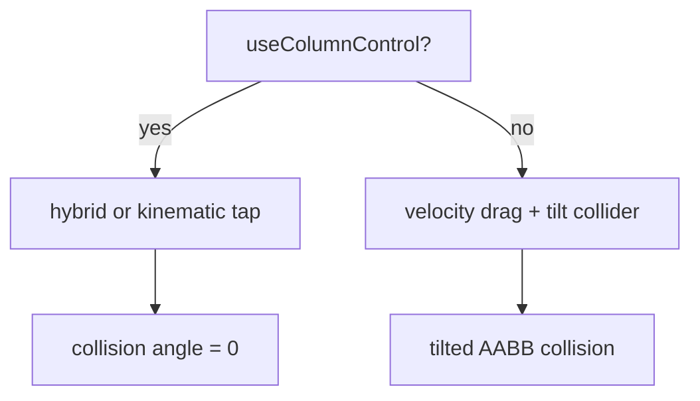

# Swimmer Physics Flow

**Status:** Architecture reference (July 2026)  
**Audience:** Developers tracing motion, collision, and game-over  
**Related:** [Swimmer character system](../visual-design/swimmer-character-system.md) · [Passage timing authority](../visual-design/logs/track2-physics-passage-timing-clarification.md)

---

## Authority chain

| Layer | Role |
|-------|------|
| `swimmerBlockCollision.ts` | Contact truth — pin, side block, ceiling carry |
| `SwimmerPhysicsSystem` | Motion integration — propose → resolve → react |
| `GameplayFeedbackSystem` | Observes physics outcomes — no parallel timing clock |

---

## Game phases

| Phase | Player sees | Module |
|-------|-------------|--------|
| Initial rise | Water climbs until rest line | `initialWaterPhase.ts` |
| Start ready | Idle bob, tap to begin | `commitFrame.commitStartReadyPose` |
| Platformer | Tap steer, rise through gaps | full pipeline |
| Pinned | Stuck under block, tap to slide | `resolvePinnedTapSlide` |

---

## Per-frame pipeline

### Ordering invariants

| # | Rule | Break symptom |
|---|------|----------------|
| 1 | Drag before tap impulse (hybrid) | Streak taps feel weak |
| 2 | Water current after horizontal control | Tap fights current wrong |
| 3 | Surface follow uses proposed X | Swimmer floats off wave |
| 4 | Collision uses proposed deltas | Tunneling or late blocks |
| 5 | Wall bump reads collision result | False bounce or no bounce |
| 6 | Game-over after resolved position | Early/late death |
| 7 | `scheduleOnRN` only at game-over | RN thread violations |

---

## Control modes

---

## Water surface lock

Swimmer Y follows `computeFinalSurfaceUv` at the swimmer's **proposed** X after horizontal integration.

| Builder | `waterLevel` source | Consumer |
|---------|---------------------|----------|
| `buildProfileFromShaderUniforms` | shader uniform | foam, contact FX |
| `buildProfileFromContainerGeometry` | container `waterSurfaceY` | swimmer physics |

`computeGapFollowMaskAtX` gates surface follow — swimmer only rides the curve inside open gap channels (> 0.15 mask).

---

## Pinned escape

Tap while pinned under a ceiling block:

1. Primary sweep with pinned collider extents
2. If motion opposes tap or is below `minPinnedSlidePx` → nav collider retry
3. If still below visible nudge → final nudge sweep
4. Return best X displacement in tap direction

Implementation: `resolvePinnedTapSlide` in `swimmerBlockCollision.ts`

---

## Module map

| File | Responsibility | Tests |
|------|----------------|-------|
| `SwimmerPhysicsSystem.ts` | ECS orchestrator | `framePipeline.test.ts` |
| `frameContext.ts` | Shared frame snapshot | — |
| `propose/bobbingBuoyancy.ts` | Sin bob + buoyancy | `framePipeline.test.ts` |
| `propose/horizontalLocomotion.ts` | Tap / pan + splash events | `swimmerHyperCasualPhysics.test.ts` |
| `propose/waterAdvection.ts` | Current relax + clamp | `framePipeline.test.ts`, `swimmerPinnedWaterCurrent.test.ts` |
| `propose/verticalSurfaceFollow.ts` | Surface Y lock | `waterSurfaceProfile.test.ts` |
| `resolve/collisionResolution.ts` | Row sweep + pin splash | `swimmerBlockCollision.test.ts` |
| `swimmerBlockCollision.resolvePinnedTapSlide` | Pinned tap slide | `swimmerBlockCollision.test.ts` |
| `react/wallBump.ts` | Side block rebound | `swimmerBounceDisruptor.test.ts` |
| `react/gameOver.ts` | Score + persist bridge | — |
| `react/commitFrame.ts` | Component writes | `framePipeline.test.ts` |
| `buildWaterSurfaceProfileParams.ts` | Shader/physics profile builders | `buildWaterSurfaceProfileParams.test.ts` |

---

## Tuning keys (`swimmerTuning.ts`)

| Key | Pipeline stage |
|-----|----------------|
| `MAX_HORIZONTAL_SPEED` | water advection clamp |
| `MAX_WATER_CURRENT_SPEED` | horizontal locomotion |
| `WATER_CURRENT_RESPONSE_PER_SECOND` | water advection |
| `PINNED_VELOCITY_DAMPING` | water advection |
| `PINNED_TAP_VISIBLE_NUDGE_COLUMN_FRACTION` | pinned escape |
| `SURFACE_SUBMERGENCE_RATIO` | vertical surface follow |
| `SURFACE_FOLLOW_RESPONSE_PER_SECOND` | vertical surface follow |
| `MAX_VERTICAL_STEP_BLOCK_FRACTION` | buoyancy integration |
